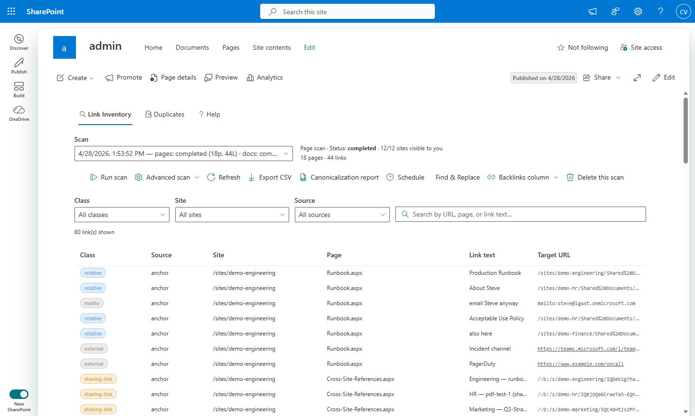
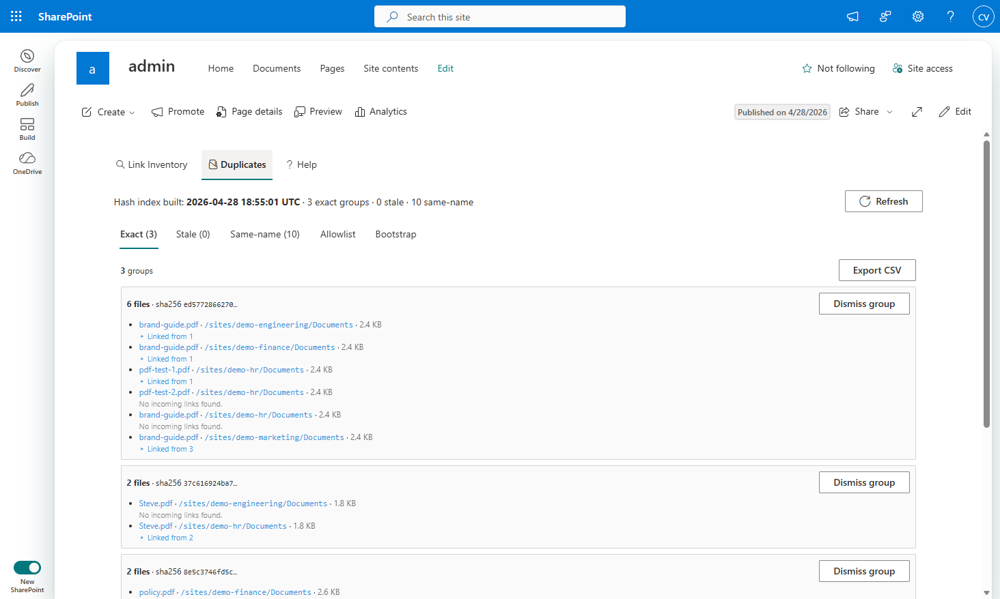
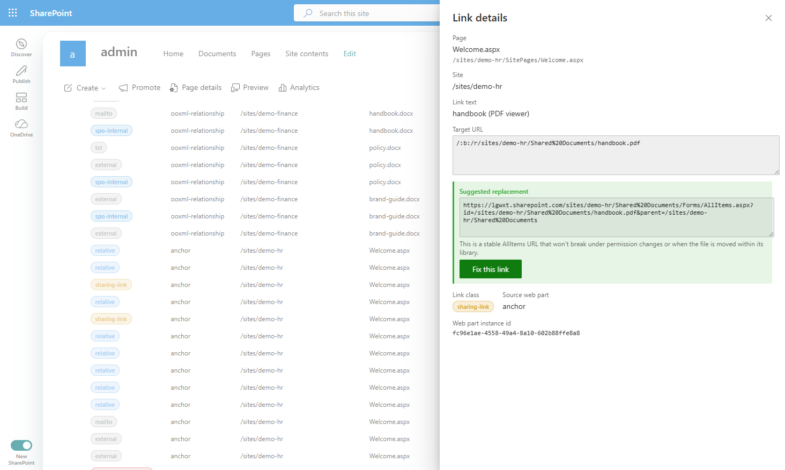
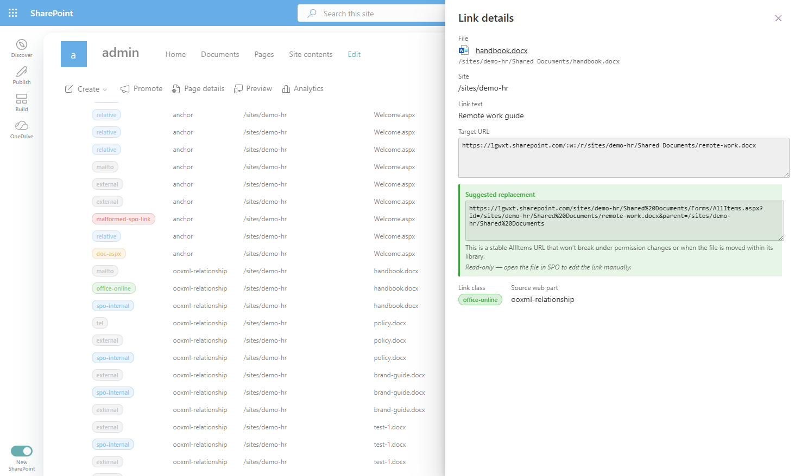
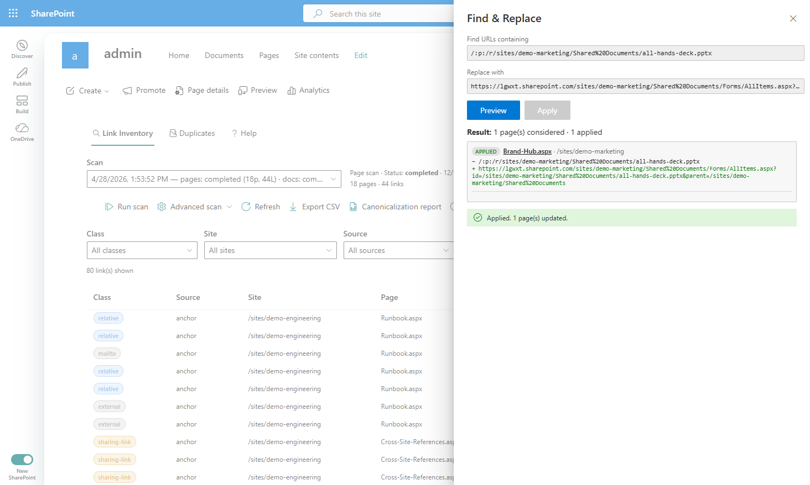
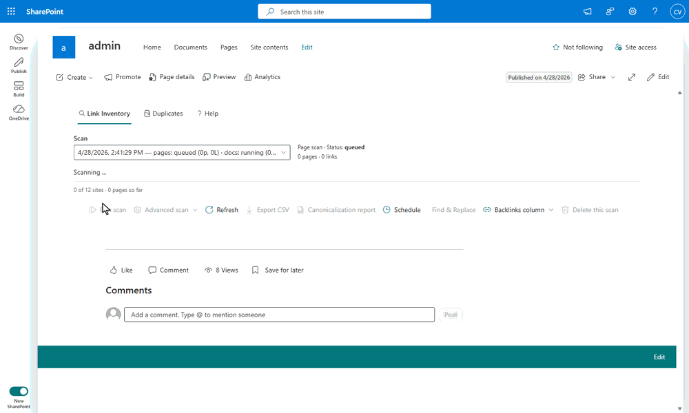

# spo-link-inventory

Tenant-wide SharePoint Online link inventory, duplicate-file detection, and orphan-asset cleanup. Ships as an Azure Function backend plus an SPFx admin web part.

> **Status:** v0.1.0-pre. Initial open-source extract from a working production deployment.

## What it does

**Link inventory.** Walks every site you can reach, every modern page, and every Office/PDF document, extracts the links inside each one, and stores them so you can search the whole tenant for a URL or pattern. Surface broken links, count references to a target, find every page that links to a given file, and run find-and-replace across all of them in one operation.



**Duplicate detection.** SHA-256 every file in your scanned libraries and group by hash to find exact duplicates. Detect "stale copies" by walking version history (a previous version of file A matches the current content of file B → B is the authoritative copy and A is stale). Detect same-name pairs across sites for content owners to triage.



**Orphan asset cleanup.** Files under `SiteAssets/SitePages/` that no current page references, typically left behind when pages get deleted (SharePoint doesn't clean up the per-page asset folder). Detection is reference-based (a query against the same backlinks index), not name-based: pages that have been renamed and pages from custom templates (folder is a GUID) are correctly retained because their `CanvasContent1` still references the original folder URL. Recycle action moves files to the SP recycle bin and runs as the calling user via OBO, so audit attribution stays correct.

**Backlinks.** Persist a "linked from" index keyed by file canonical URL. Both reports show what other pages and documents point at each row, so removing a duplicate or fixing a broken link is a one-click decision instead of a research project.

**Per-row detail + Find & Replace.** Click any row to see the full classification (sharing wrapper, Office Online viewer, AllItems direct, malformed, etc.) plus a one-click suggestion to canonicalize the link.

| Page-row link | Document-row link |
|---|---|
|  |  |

Page rows expose **Fix this link** (writes through canvas PATCH under the user's identity); document rows are read-only because rewriting hyperlinks inside binary OOXML/PDF files is out of scope. Both kinds appear in the same merged inventory.

After running F&R, the result row links straight to the patched page so you can verify the change in one click:



### End-to-end in ~15 seconds

Run scan → merged page+doc results → drill into a sharing-wrapper row → Fix this link → preview the diff → apply → result row deep-links to the patched page.



## Architecture

```
SPFx Admin Web Part           ← admin UI: scan / browse / find&replace / dupes / orphans
       │ AadHttpClient (OBO)
       ▼
Azure Function HTTP triggers  ← /api/link-inventory/*, /api/duplicates/*, /api/orphan-assets/*
       │
       ├── enqueue ──► Storage Queues (page-scan, doc-scan)
       │                       │
       │                       ▼
       │                   Queue Workers (one site / one file per message)
       │                       │
       │                       ├── SP REST: enumerate sites + libraries + files
       │                       └── Extract links: canvas + OOXML + pdfjs
       │
       ├── Job state ──────► Azure Table (link inventory + duplicates + orphan-recycle jobs)
       └── Result blobs ───► Azure Blob (per-job + rollforward aggregate)

Daily retention timer @ 03:00 UTC ──► purges jobs older than 30 days
Hourly schedule timer ──► fires daily delta scan when due (UI-controlled)
```

## Layout

```
spo-link-inventory/
├── func/             # Azure Function (Node.js v4 programming model)
├── spfx/             # SPFx admin web part (Heft toolchain, SPFx 1.22)
├── infra/            # Bicep templates for Azure resources
├── scripts/          # Entra setup + provider registration + federated credential
└── docs/             # Deploy guide
```

## Deploy

See **[docs/deploy.md](docs/deploy.md)** for the full end-to-end. The short form:

```bash
# 1. Cost guard (one-time, recommended)
# (see docs/deploy.md for the budget command)

# 2. Resource provider registration in your Azure subscription (one-time, ~3 min)
az login
az account set --subscription <your-sub-id>
./scripts/register-providers.sh

# 3. Entra app + admin group in your SharePoint tenant
#    (default: cert auth + broad SP read; see docs/deploy.md for federation + Sites.Selected modes)
az login --tenant <sp-tenant>.onmicrosoft.com --allow-no-subscriptions
./scripts/setup-entra.sh
source scripts/.entra-output.env

# 4. Provision Azure resources (Bicep, ~5 min)
az login                                    # back to your Azure-tenant login
az account set --subscription <your-sub-id>
az deployment sub create \
  --location centralus \
  --template-file infra/main.bicep \
  --parameters projectName=linkinv01 spoTenantHost=<sp-tenant>.sharepoint.com \
               entraTenantId=$ENTRA_TENANT_ID entraClientId=$ENTRA_CLIENT_ID adminGroupId=$ADMIN_GROUP_ID \
               authMode=$AUTH_MODE clientCertPemBase64=$ENTRA_CLIENT_CERT_PEM_BASE64

# 5. Build + publish the function code
cd func && npm install && npm run build
func azure functionapp publish func-linkinv01 --typescript --build remote
```

That's five commands plus the one-time provider registration. Cost expected: $0/month under always-free quota. (Federation auth mode adds a sixth step, `add-federated-credential.sh`; see deploy.md.)

## Local dev

```bash
# 1. Install deps
cd func && npm install

# 2. Start Azurite (Storage emulator) in a separate terminal
npx azurite --silent

# 3. Configure local secrets
cp local.settings.json.example local.settings.json
# Edit local.settings.json: set SPO_TENANT_HOST, LINK_INVENTORY_TENANT_ID,
# LINK_INVENTORY_CLIENT_ID, LINK_INVENTORY_ADMIN_GROUP_ID

# 4. Run
npm start
```

The function runs at `http://localhost:7071`. Test with:

```bash
curl http://localhost:7071/api/link-inventory/ping   # returns 401 without auth (expected)
```

For the SPFx side:

```bash
cd spfx/link-inventory-admin
npm install
npm run start    # workbench on https://localhost:4321
```

## Configuration reference

### Function App settings

| Setting | Required | Description |
|---|---|---|
| `SPO_TENANT_HOST` | Yes | Tenant SP hostname, e.g. `contoso.sharepoint.com` (no protocol) |
| `LINK_INVENTORY_TENANT_ID` | Yes | Entra tenant GUID where the SP app registration lives |
| `LINK_INVENTORY_CLIENT_ID` | Yes | Client ID of the Entra app the function uses for OBO |
| `LINK_INVENTORY_ADMIN_GROUP_ID` | Yes | GUID of the Entra group whose members are admins |
| `LINK_INVENTORY_AUTH_MODE` | Optional | `cert` (default) or `federation`. See [docs/deploy.md](docs/deploy.md) for the tradeoff. |
| `LINK_INVENTORY_CLIENT_CERT_PEM_BASE64` | Cert mode | Base64 of the combined PEM (cert + private key). For prod, replace with a Key Vault reference. |
| `TABLE_CONNECTION_STRING` | Yes | Storage account connection string (Bicep sets this automatically) |
| `OBO_TARGET_SCOPE` | Optional | Override the OBO target scope (defaults to `https://${SPO_TENANT_HOST}/.default`) |
| `LEGACY_SP_HOSTS` | Optional | Comma-separated legacy/on-prem SP hostnames to classify as `onprem` |
| `ORPHAN_INDEX_WARN_AGE_MIN` | Optional | Minutes since last persistent-index merge before the orphan report shows a soft "stale index" warning (default `60`). |
| `ORPHAN_INDEX_BLOCK_AGE_MIN` | Optional | Minutes since last persistent-index merge before the orphan report refuses to run (default `360`). Override on a per-request basis by setting `acknowledgedStaleIndex: true` in the POST body. |

### SPFx web part properties

| Property | Description |
|---|---|
| `functionUrl` | Base URL of your deployed Azure Function, e.g. `https://func-linkinv01.azurewebsites.net` |
| `entraAppApiUri` | Entra app's "Application ID URI" (api://...). Find it on the app registration's *Expose an API* blade. **Use the URI form, not the friendly display name**; friendly-name lookup intermittently fails on tenants. |

## License

[MIT](LICENSE)

